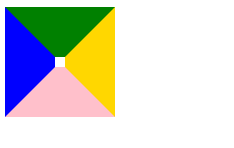

### 利用css 的border 属性来画三角形

> 想要画一个三角形,我们可以利用border属性来到达.下面我就和大家一起来看看怎么实现?.

```html

<body>
    <div id="box"></div>
</body>

```


```css

#box{
      width:10px;
      height:10px;
      border-top: 50px solid green;
      border-right: 50px solid gold;
      border-bottom: 50px solid pink;
      border-left: 50px solid blue;
  }

```

> 当盒子的border值大于宽高值的时候,我们发现出现了下图情况.



> 我们发现已经很接近三角形了,那如果我们边框改为0呢?我们再来试试.

```css

#box{
      width:0px;
      height:0px;
      border-top: 50px solid green;
      border-right: 50px solid gold;
      border-bottom: 50px solid pink;
      border-left: 50px solid blue;
  }

```

;

>` 于是得到结论:当边框的值大于盒子宽高的值,并且宽高值都为0的时候就可以得到三角形`.

```css3
#box{
      width:0px;
      height:0px;
      border-top: 50px solid green;
      border-right: 50px solid transparent;
      //border-bottom: 50px solid pink; 对边不用设置
      border-left: 50px solid transparent;
  }

```

>那上面的情况显然并是我们能用的,如果想要出现单个的三角形怎么办呢?只用记住一个规律就可以:
>  假如我们想要设置的是上图中的绿色三角形,那么我们就不用设置它的对边,但是要把于它垂直方向的两个方向都设置为transparent.


